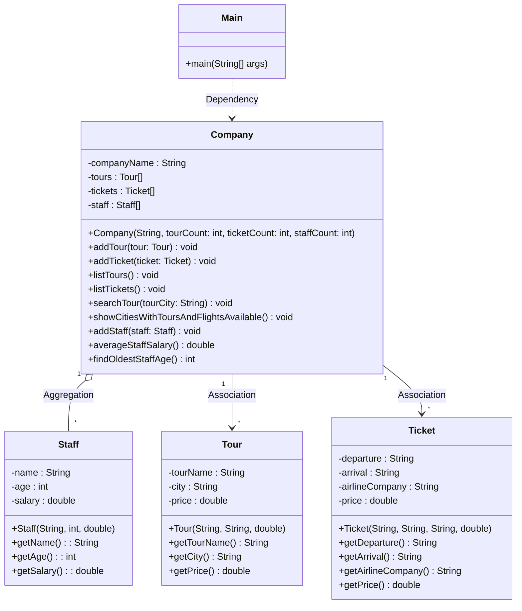
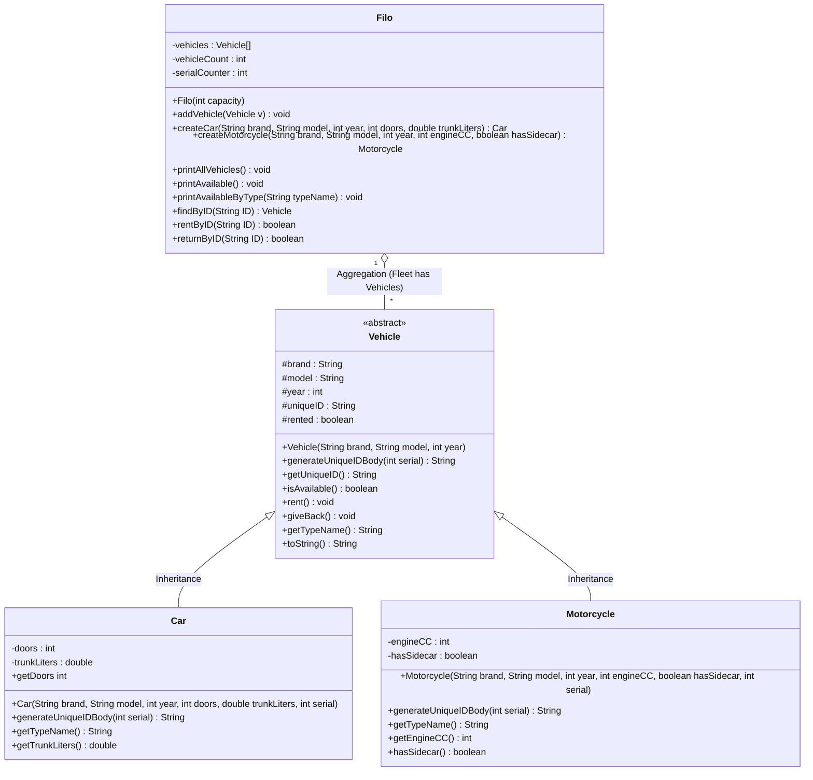

# oop_learning_projects
My OOP learning journey. Demonstrates OOP concepts through code examples and class design.

## Travel Agency System
**Folder:** `01_Travel_Agency_System`
* **Focus:** Association, Dependency, Aggregation relationships.
* **Description:** A system managing tours, tickets, and staff using separate classes.

### UML Class Diagram


## Vehicle Rental System
**Folder:** `02_Vehicle_Rental_System`  
* **Focus:** Inheritance, Polymorphism, Abstraction, Encapsulation.
* **Description:** A simulation managing a fleet of cars and motorcycles using inheritance and polymorphism.


### UML Class Diagram


## Food Delivery System
**Folder:** `03_Food_Delivery_System`
* **Focus:** Interfaces, Custom Exceptions, Collections (HashMap), Polymorphism.
* **Description:** An ordering system connecting customers and products using interfaces. It features custom exception handling for cart management and uses HashMaps for efficient product lookup.

### UML Class Diagram

```mermaid
classDiagram
    class Main {
        +main(String[] args)
    }

    class Sellable {
        <<interface>>
        +getId() String
        +getName() String
        +getPrice() double
    }

    class Food {
        -id : String
        -name : String
        -price : double
        -restaurant : String
        +Food(String id, String name, double price, String restaurant)
        +toString() String
    }

    class Drink {
        -id : String
        -name : String
        -price : double
        -size : String
        +Drink(String id, String name, double price, String size)
        +toString() String
    }

    class FoodDeliveryPlatform {
        -products : HashMapString_Sellable
        +FoodDeliveryPlatform()
        +addProduct(Sellable product) void
        +getProduct(String id) Sellable
        +listProducts() void
        +searchByPriceRange(double min, double max) void
    }

    class Customer {
        -id : String
        -name : String
        -cart : ArrayList<Sellable>
        +Customer(String id, String name)
        +addToCart(Sellable item) void
        +removeFromCart(String itemId) void
        +showCartDetails() void
        +Payment() void
    }

    class ItemAlreadyinCartException {
        +ItemAlreadyinCartException(String message)
    }

    %% Relationships
    Sellable <|.. Food : Implements
    Sellable <|.. Drink : Implements
    Customer o-- Sellable : Aggregation (Cart contains Sellables)
    FoodDeliveryPlatform o-- Sellable : Aggregation (Map contains Sellables)
    Customer ..> ItemAlreadyinCartException : Throws
    Main ..> FoodDeliveryPlatform : Uses
    Main ..> Customer : Uses
